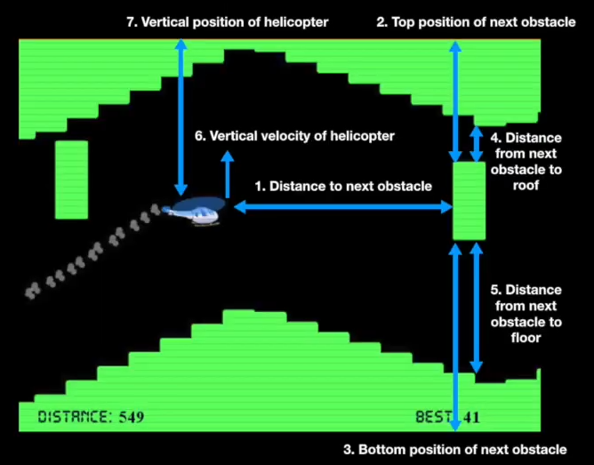

# Helicopter Neuroevolution

There's an old game called Helicopter that I used to play as I kid. It was really tough!  
You can play it online here: [Helicopter Game | Addicting Games](https://www.google.com/url?q=https%3A%2F%2Fwww.addictinggames.com%2Fclicker%2Fhelicopter-game&sa=D) 

As a kid, I always wanted to get really good at this game. As an adult, I realize that it's easier to just train an AI to do it!

This game was created using p5.js and training using Genetic Neuroevolution.

## Neural Network Inputs

## First Prototype

## Final Result

